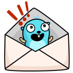

<div align="center">



[](https://goreportcard.com/report/github.com/nikoksr/notify)
[](https://www.codacy.com/gh/nikoksr/notify/dashboard?utm_source=github.com&amp;utm_medium=referral&amp;utm_content=nikoksr/notify&amp;utm_campaign=Badge_Grade)
[](https://codeclimate.com/github/nikoksr/notify/maintainability)
[](https://app.fossa.com/projects/git%2Bgithub.com%2Fnikoksr%2Fnotify?ref=badge_shield)
[](https://pkg.go.dev/github.com/nikoksr/notify)

</div>

> <p align="center">A dead simple Go library for sending notifications to various messaging services.</p>

<h1></h1>

## About <a id="about"></a>

*Notify* was born out of my own need to have my API servers running in production be able to notify me when critical errors occur. Of course, _Notify_ can be used for any other purpose as well. The library is kept as simple as possible for quick integration and ease of use.

## Disclaimer <a id="disclaimer"></a>

Any misuse of this library is your own liability and responsibility and cannot be attributed to the authors of this library.  See [license](LICENSE) for more.

Spamming through the use of this library **may get you permanently banned** on most supported platforms.

## Install <a id="install"></a>

```sh
go get -u github.com/nikoksr/notify
```

## Example usage <a id="usage"></a>

```go
// Create a telegram service. Ignoring error for demo simplicity.
telegramService, _ := telegram.New("your_telegram_api_token")

// Passing a telegram chat id as receiver for our messages.
// Basically where should our message be sent?
telegramService.AddReceivers(-1234567890)

// Create our notifications distributor.
notifier := notify.New()

// Tell our notifier to use the telegram service. You can repeat the above process
// for as many services as you like and just tell the notifier to use them.
// Inspired by http middlewares used in higher level libraries.
notifier.UseServices(telegramService)

// Send a test message.
_ = notifier.Send(
	context.Background(),
	"Subject/Title",
	"The actual message - Hello, you awesome gophers! :)",
)
```

## Supported services <a id="supported_services"></a>

> Please create feature requests for missing services (see #3 for example)

- *Amazon SES*
- *Discord*
- *Email*
- *Line & Line Notify*
- *Mailgun*
- *Microsoft Teams*
- *Plivo*
- *Pushbullet*
- *RocketChat*
- *SendGrid*
- *Slack*
- *Telegram*
- *TextMagic*
- *Twitter*
- *WeChat*
- *WhatsApp*

## Credits <a id="credits"></a>

- Amazon SES support: [aws/aws-sdk-go](https://github.com/aws/aws-sdk-go)
- Discord support: [bwmarrin/discordgo](https://github.com/bwmarrin/discordgo)
- Email support: [jordan-wright/email](https://github.com/jordan-wright/email)
- Line support: [line/line-bot-sdk-go](https://github.com/line/line-bot-sdk-go)
- Line Notify support: [utahta/go-linenotify](https://github.com/utahta/go-linenotify)
- Logo: [MariaLetta/free-gophers-pack](https://github.com/MariaLetta/free-gophers-pack)
- Mailgun support: [mailgun/mailgun-go](https://github.com/mailgun/mailgun-go)
- Microsoft Teams support: [atc0005/go-teams-notify](https://github.com/atc0005/go-teams-notify)
- Plivo support: [plivo/plivo-go](https://github.com/plivo/plivo-go)
- Pushbullet support: [cschomburg/go-pushbullet](https://github.com/cschomburg/go-pushbullet)
- RocketChat Support: [RocketChat/Rocket.Chat.Go.SDK](https://github.com/RocketChat/Rocket.Chat.Go.SDK)
- SendGrid support: [sendgrid/sendgrid-go](https://github.com/sendgrid/sendgrid-go)
- Slack support: [slack-go/slack](https://github.com/slack-go/slack)
- Telegram support: [go-telegram-bot-api/telegram-bot-api](https://github.com/go-telegram-bot-api/telegram-bot-api)
- TextMagic support: [textmagic/textmagic-rest-go-v2](https://github.com/textmagic/textmagic-rest-go-v2)
- Twitter: [dghubble/go-twitter](https://github.com/dghubble/go-twitter)
- WeChat: [silenceper/wechat](https://github.com/silenceper/wechat)
- WhatsApp: [Rhymen/go-whatsapp](https://github.com/Rhymen/go-whatsapp)

## Author <a id="author"></a>

**Niko Köser**

* Twitter: [@nikoksr](https://twitter.com/nikoksr)
* Github: [@nikoksr](https://github.com/nikoksr)

## Contributing <a id="contributing"></a>

Contributions, issues and feature requests are welcome!<br />Feel free to check [issues page](https://github.com/nikoksr/notify/issues). You can also take a look at the [contributing guide](https://github.com/nikoksr/notify/blob/main/CONTRIBUTING.md).

## Show your support <a id="support"></a>

Give a ⭐️ if you like this project!

## License <a id="license"></a>

[](https://app.fossa.com/projects/git%2Bgithub.com%2Fnikoksr%2Fnotify?ref=badge_large)
